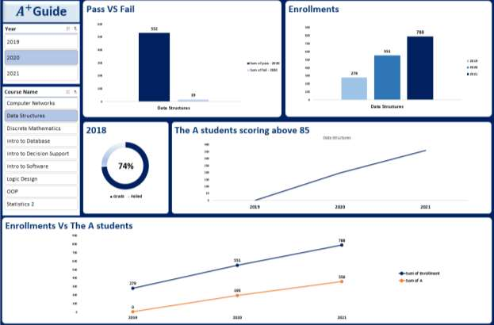
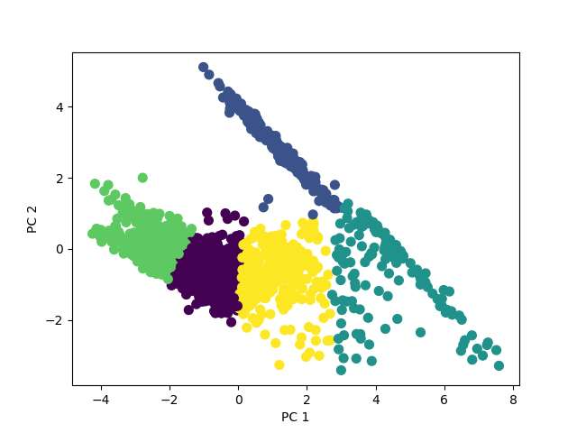
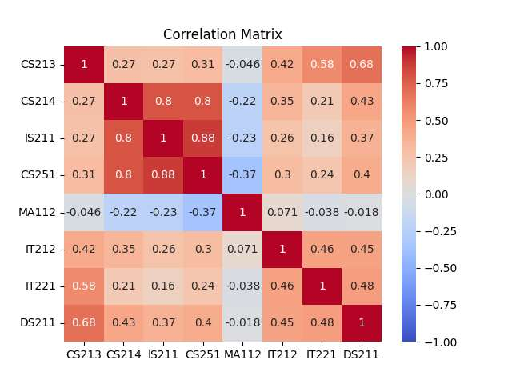
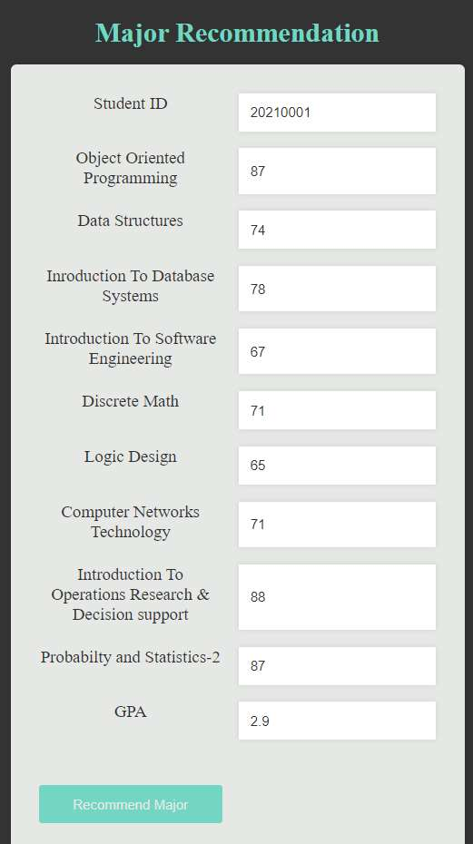

# A+ Guide — College Major Recommender System

A machine learning system that helps university students choose the right major by clustering their academic performance in prerequisite courses and recommending departments where similar-performing students have historically done well. Built as a Bachelor's graduation project at Cairo University's Faculty of Computers and Artificial Intelligence (FCAI).

*Initial exploratory dashboard used to understand pass/fail rates, enrollments, and top-performer trends before modeling.*

## Problem

Every year, sophomore students at FCAI have to pick a major without much data to guide the decision. A survey run as part of this project found that **75% of students did not find it easy to choose their major** — most were choosing based on guesswork rather than any real signal about where they'd actually perform well. That leads to avoidable struggles, department-switch requests, and course dropouts later on.

## Approach

- **Data:** Real academic records for ~1,700 FCAI students under the college's GPA system (Fall 2018 onward) — grades in each department's two prerequisite courses, plus GPA through the second academic level.
- **Preprocessing:** Grades were represented as vectors per student, standardized with `StandardScaler`, and reduced to 2 dimensions with PCA to make clustering tractable.
- **Clustering:** K-Means (K=5, one cluster per major: CS, IS, AI, IT, DS) grouped students by prerequisite-course performance to find which grade patterns associate with which majors.

*Students clustered by prerequisite-course performance, reduced to 2D via PCA — each color is one major cluster.*

- **Recommendation system:** For each student, the two prerequisite-course scores for every department are summed and ranked, producing an ordered list of the 5 best-fit majors. A GPA-eligibility check (based on each department's minimum GPA) then filters that list down to majors the student can actually enroll in.
- **Correlation check:** Prerequisite-course performance was found to correlate with actual major choice at only **28.2%** — evidence that students are largely choosing majors without connecting them to where they're academically strongest.

*Correlation between prerequisite-course scores — the weak correlation with chosen major supports the "students choose blindly" finding.*

## Results

To test whether the recommendations were meaningful, we compared each student's average performance before choosing a major (levels 1–2) against after (levels 3–4):

| Group | Sample | % who improved in levels 3–4 |
|---|---|---|
| Students who ended up in their **A+ Guide top recommendation** (no GPA constraint) | ~330 students (19% of historical data) | **91.19%** |
| Students who ended up in an A+ Guide-recommended major **with GPA constraint applied** | ~780 students (44% of historical data) | 77% |
| Students who chose their major on their own, unmatched to any recommendation | remaining students | 51% |

Students who landed in a department the system recommended were far more likely to improve in their major years than students who chose independently — a ~40-point gap in improvement rate between the top-recommendation group and the self-chosen group.

## Tech Stack

- **Python** — pandas, NumPy
- **scikit-learn** — K-Means, PCA, StandardScaler
- **Matplotlib / Seaborn** — clustering and performance visualizations
- **Excel** — initial data preparation, cleaning, and dashboarding

## User Interface

A prototype form-based UI (see documentation) lets a student enter their prerequisite-course grades and GPA and returns a ranked list of recommended majors.

## Documentation

Full methodology, data preparation steps, dashboard analysis, and all figures/tables referenced above are in [`Graduation_project_Documentation.pdf`](Graduation_project_Documentation.pdf).

## Team

- Mario Emad Naguib
- Ahmed Hany Hamdy
- Hossam Khaled Fawzy

Supervised by Prof. Dr. Ihab El Khodary and Dr. Marwa Mostafa Sabry, Cairo University, 2023.

## Files

- `main.py` — data cleaning, clustering, recommendation logic, and system testing
- `Graduation_project_Documentation.pdf` — full project writeup, methodology, and results

## Notes

This was completed as an academic graduation project using real (anonymized) student records obtained with faculty approval, and reflects the scope of that setting rather than a production system.

---

**Author:** Mario Fahim
